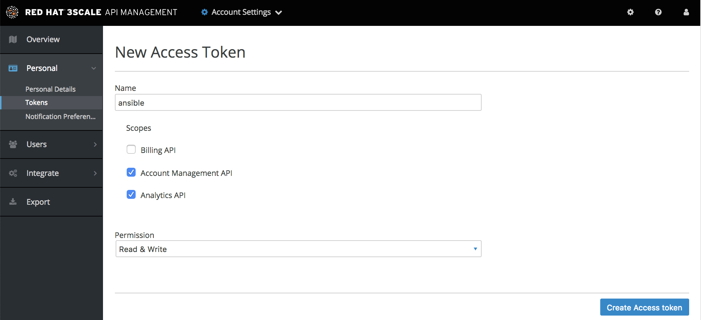
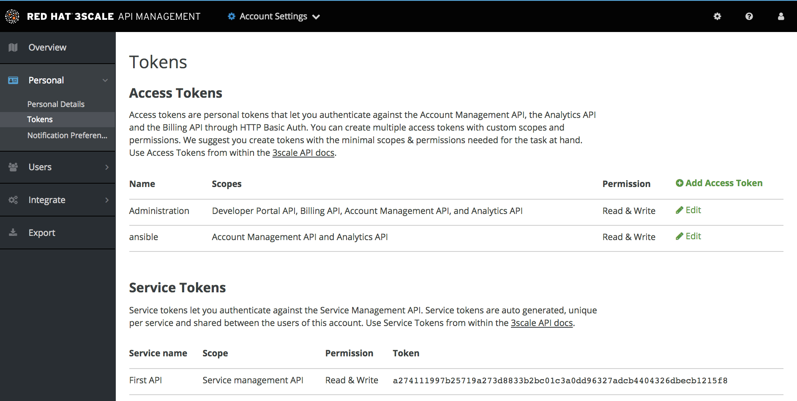
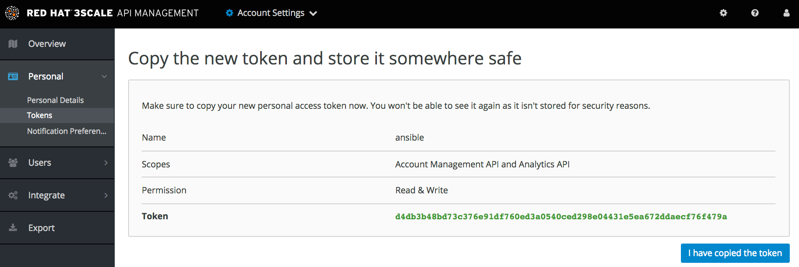

### 3SCALE API TOOLS

##### PRE-INSTALL REQUIREMENTS (mac osx)

```
brew tap jmespath/jmespath
brew install jp
brew upgrade && brew install jp
pip install jmespath-terminal
```

Create a new 3Scale `access-token` inside 3Scale admin portal:







Copy the generated `access-token` into a file for later use.

Edit the `hosts.example` file with your hostname and access-token.

Then:

`sudo bash -c 'cat hosts.example >> /etc/ansible/hosts'`

##### CONFIGURE

Edit the `main.yml` with your apis to be created.

##### RUNNING

`ansible-playbook main.yml -vvv -c paramiko -k --flush-cache --extra-vars "ansible_user=raphael"`

